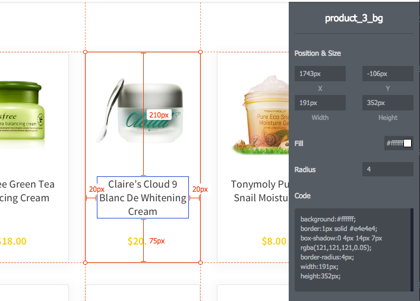

# React Product Gallery

For this project, you will build a product gallery using React. The finished product should look visually similar to that of the provided mock ups as well as satisfy the requirements described the in the specs below.
 
- The project consists of 2 primary screens: "Product Listing" and "Product Details".
- The required data is provided for you. See [`src/data.js`](src/data.js).
- You will not have to implement any HTTP requests to fetch the data. You may read the data directly from `src/data.js`.
- The project is designed to be completable in roughly 4 hours.
- Use [Font Awesome](http://fontawesome.io/examples/) for any icons you may need. The CSS is already present on the page.
- This project uses the latest versions of the following packages:
  - React & ReactDOM, feel free to use the latest features like hooks, React.memo, etc.
  - Lodash, for all your utility needs.
  - Jest, for any tests you wish to add. :wink:

## Instructions

- Clone this repo via `git clone git@github.com:practicegenius/react-product-gallery.git`
- `cd react-product-gallery` and install dependencies via `yarn install`
- Execute `yarn start` to begin the development server.
- You should be able to reach the project at http://localhost:3000/

_*[`yarn`](https://yarnpkg.com) is interchangeable with [`npm`](https://www.npmjs.com/) throughout these instructions_

_The project structure/boilerplate is based around [create-react-app](https://github.com/facebookincubator/create-react-app#create-react-app).
 This means you don't have to worry about setting up any dependencies, build steps, boilerplate, etc... Everything just works right out of the box including ES6+ syntax among many other modern development conveniences and features.  For additional information specific to `create-react-app` see [the docs](https://github.com/facebookincubator/create-react-app#create-react-app-)._

## Screen 01: Product Listing

_This screen displays a listing of products along with various search and filter controls._

**Display Products**

Display the appropriate products based on the current category, search text, and price filter.

Each product in the listing should be clickable to view the Product Details screen for that product.

**Search Products**

Search products by name via the text search input.

**View Products by Category**

Products are viewed by category. The categories should be listed in the sidebar.

There will always be an active category. Clicking a category in the sidebar should update the active category.

**Filter by Price**
 
Filter products by min price and max price. Both fields are optional.

## Screen 02: Product Details

_This screen displays more detailed information about a single product._

**Modal**

The product details view is displayed within a modal. The modal should be closable by clicking the "X" in the top right corner of the modal.

## Utilizing the Prototype

See the [interactive prototype](prototype/index.html) to view and inspect the design. This prototype is generated from the design files, so the HTML itself won't be much use to you. Feel free to use it for easily inspecting sizes, spacing, and colors.

To access the prototype, navigate to your project directory and open the `prototype/index.html` in your browser. Examples:

* From the terminal: `open prototype/index.html`
* From the file browser: Drag and drop `prototype/index.html` onto your browser.

### _*Bonus Feature_

Implement one bonus feature of your choosing. _Feel free to be creative and come up with your own_ or choose from the following:
- Add sorting options (e.g. sort by price lowest/highest).
- Add an "Add to Cart" button and display sub-total in the header.
- Paginate items (e.g. 8 per page).
- Add test coverage.
- Add a "Related Products" section to the Product Details page.
- Use React Router where you deem appropriate.
- Deploy the app (see https://facebook.github.io/create-react-app/docs/deployment)
